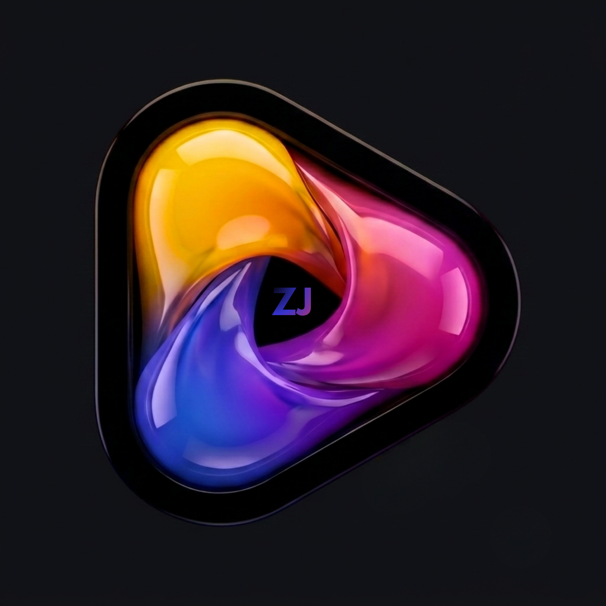

  
  <h1>Sportify</h1>
  
Never miss a match. A modern desktop application built to bring live sports streams and custom M3U playlists together in a stunning, user-friendly interface.

 

## Features

- Instantly view upcoming and live sports events across Football, Cricket, F1, MotoGP, Tennis, Golf, and more.
- Paste your own M3U playlists to seamlessly watch custom IPTV streams within the app.
- Secure PIN-based login system for multiple users, with customizable avatars and profile settings.
- Built with React, Vite, and Electron, featuring a premium dark mode aesthetic, glassmorphism, and smooth micro-animations.
- The backend is lightweight and serverless, powered entirely by Cloudflare Workers and Cloudflare KV.

## How to Install

The easiest way to use Sportify is to download the pre-built desktop installer for Windows. 

1. **[Click here to go to the Releases page](https://github.com/yaseenzj/Sportify/releases/latest)**
2. Under the **Assets** section of the latest release, download the `Sportify-Setup-X.X.X.exe` file.
3. Run the `.exe` file to install the app. It will automatically keep itself updated!

---
## Legal Disclaimer

**Sportify** is purely a media player and management interface. 
- The creator of this repository does **NOT** host, provide, or distribute any media content, streams, or copyright-protected material.
- Any streams, JSON URLs, or M3U playlists provided as examples or defaults in the code (or used by the community) are sourced freely from the open-source internet.
- The creator assumes **zero responsibility** for the content that users choose to consume or manage using this software. Use this application at your own risk and ensure you comply with the copyright laws of your jurisdiction.

## 🤝 Contributing
Contributions are always welcome! Feel free to open a pull request or submit an issue if you find a bug or have a feature request.
